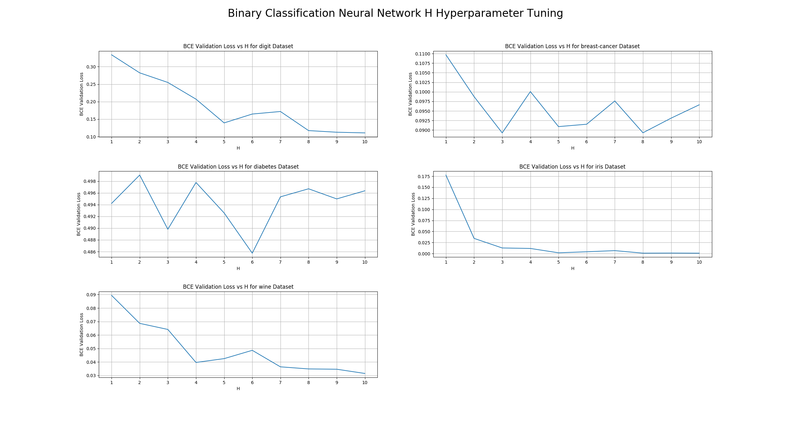
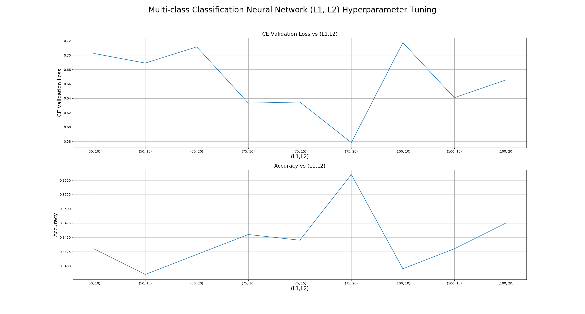
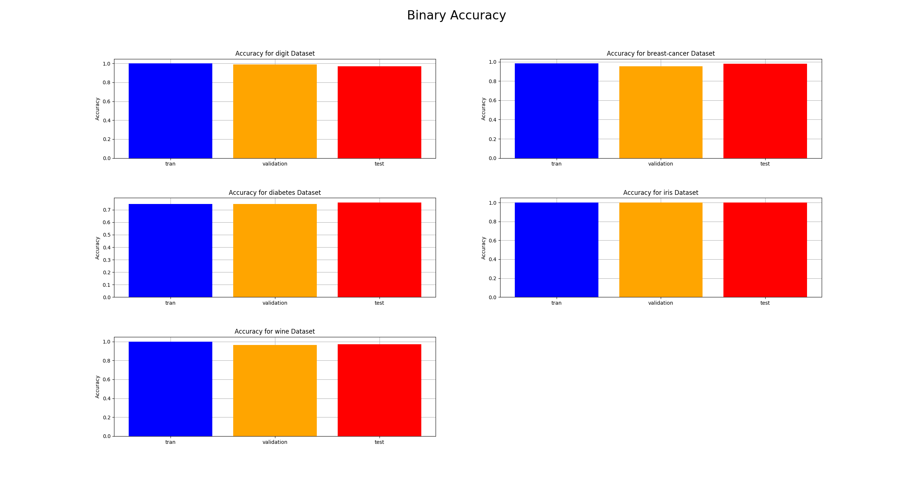
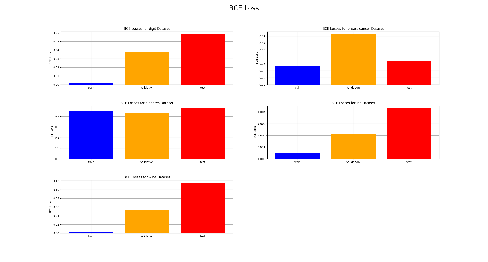
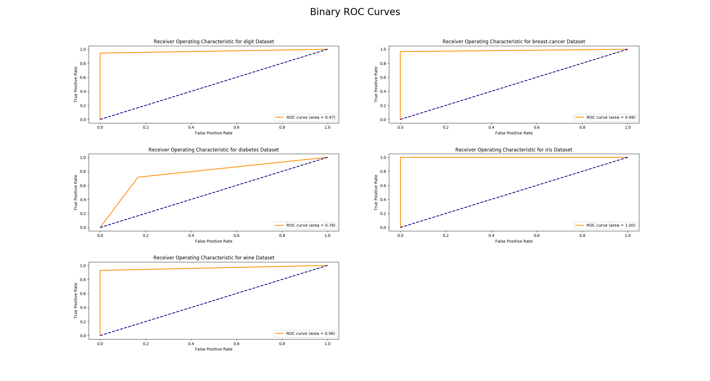
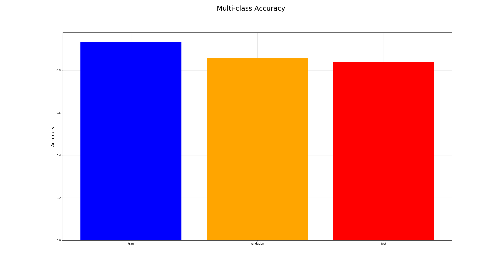

# Task 1 Report by Ryan Wickman
## Experiment Settings
### Binary Classification Hyperparameters
Hyperparameter | Value
------------|------------
Optimizer         | Adam
Learning Rate     | 0.01
LR Decay Rate     | 0.99
Epochs            | 100
Batch Size        | 16
Early Stopping    | True
Patience          | 10
Num. Random init  | 3
K-fold Split Size | 5
Feature Scaling   | Standardization

### Multi-class Classification Hyperparameters
Hyperparameter | Value
------------|------------
Optimizer         | Adam
Learning Rate     | 0.01
LR Decay Rate     | 0.99
Epochs            | 100
Batch Size        | 128
Early Stopping    | True
Patience          | 10
Num. Random init  | 3
K-fold Split Size | N/a
Feature Scaling   | Standardization

## Parameter Tuning Results
### Binary Classification Tuning Results
I used k-fold cross-validation to evaluate the number of units in the hidden layer, H,  that provides the lowest validation loss.
In my experiments, H was tested on values in the range of [1,10].

The table in the Binary Classification Hyperparameters section above provides details on how the experiments were setup.

The figure below displays the BCE Validation Loss vs H plot for every dataset: 

From the graph above, you can easily evaluate the best H value for every dataset.

### Multi-class Classification Tuning Results
I used normal cross-validation, a simple 80/20 split between the training and validation set. I used this to evaluate the number of units in to use in first hidden layer and the second hidden layer, L1 and L2; respectively. L1 was tested on values {50, 75, 100} and L2 was tested on values {10, 15, 20}.

The table in the Multi-class Classification Hyperparameters section above provides details on how the experiments were setup.

The figure below displays both the CE Validation Loss vs (L1, L2) plot and the Accuracy vs (L1, L2) plots, where every combination of L1 and L2 is included:

From the graph above, you can easily evaluate the best L1 and L2 combination. When L1 = 75 and L2 = 20, we get the minimum cross-entropy loss and the maximum accuracy.

## Best Model Results
###  Binary Classification Best Model Results
Using the best H value for every dataset, the figure below displays the accuracy on the training, validation, and testing set. This assumed a decision threshold = 0.5.

The figure below displays the BCE loss on the training, validation, and testing set.

The figure belows displays the ROC curve based on the testing set.

Amazingly, most of the models had an AUC score close to 1.

### Multi-class Classification Best Model Results
The figure below displays the accuracy using L1 = 75 and L2 = 20 on the training, testing, and validation set.

As you can see, it was able to achieve a testing set accuracy of approximately 84%.